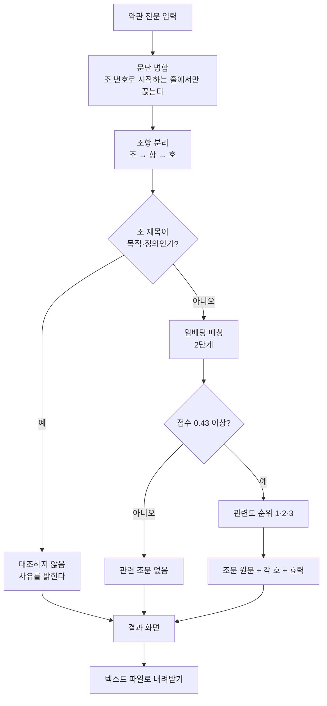

# 계약서 돋보기 (Contract Lens)

**약관 조항에 관련 법 조문을 나란히 놓는 도구**

동아AI랩 3기 3차 프로젝트 · 최지수 · 2026.08

---

## 1. 한 줄 요약

계약서나 약관을 붙여넣으면 **조항마다 관련 있어 보이는 「약관의 규제에 관한 법률」 조문을
찾아 나란히 보여 준다.** 불공정 여부는 판정하지 않는다.

---

## 2. 왜 만들었나

계약서를 받았는데 법을 모르는 사람은 **어디를 봐야 할지조차 모른다.** 조항이 서른 개인데
그중 무엇이 문제가 될 수 있는지 판단할 기준이 없다.

이때 필요한 것은 "이 계약은 불공정합니다" 같은 판정이 아니다. **"제7조가 면책조항 규정과
관련 있어 보이니 그 조문을 읽어 보라"는 실마리**다. 읽고 판단하는 것은 본인, 다투게 되면
변호사의 몫이다.

### 판정하지 않기로 한 이유

두 가지다.

**법적으로**, 변호사법 제109조는 비변호사의 법률사무 취급을 금지한다. 조문을 찾아 제시하는
것과 "이 조항은 무효입니다"라고 말하는 것은 다른 일이다.

**실질적으로**, 틀렸을 때 피해가 크다. "무효입니다"를 믿고 계약을 거절했는데 틀렸다면
책임질 수 없다. 이 프로젝트의 우선순위를 처음에 이렇게 정했다.

1. 결과의 정확성과 신뢰성
2. 틀렸을 때 발생할 피해와 그 위험을 통제하는 구조
3. 실제 지불 의사가 있는 수익모델
4. 그다음이 기술 난도, 기능 수, 화려함

**이 문서의 4장 전체가 1번과 2번에 관한 것이다.**

---

## 3. 데이터

전부 공개 데이터를 API로 직접 수집했다. 출처는 **법제처 국가법령정보 공동활용**이다.

| 데이터 | 규모 | 쓰임 |
|---|---|---|
| 약관규제법 불공정 유형 | 28개 (제6~14조) | 대조 대상. 실제 매칭에는 제7~14조 24개를 쓴다 |
| 약관규제법 조문 전문 | 33개 조 / 105문장 | 조문 원문 보기 |
| 판례 | 463건 | 평가 세트 v3 (실제 사설 약관 조항 추출) |
| 표준약관(행정규칙) | 39건 | 평가 세트 v2 |

### 수집 과정에서 확인한 것

**API의 조문 필터를 믿으면 안 된다.** `JO=제7조`로 받은 판례 229건의 실제 참조조문에
제7조가 없었다. 전체 463건 중 제7조를 참조한 것은 19건뿐이었다. 그래서 색인을
**본문의 참조조문을 직접 파싱하는 방식**으로 바꿨다.

**참조조문 표기가 4종으로 섞여 있다.** 띄어쓴 것 384건, 안 띄운 것 304건. 띄어쓴 것만
잡는 정규식으로는 304건을 놓친다. 공백을 지우고 매칭해야 한다.

**제7~14조는 판례가 거의 없다.** 실제 분쟁은 제3조(설명의무)·제5조(해석)·제6조(일반원칙)
에서 일어난다(제6조 138건, 제5조 108건, 제3조 106건 대 제7조 19건). 이 사실이 나중에
평가 세트를 설계할 때 결정적으로 작용했다.

---

## 4. 결과 신뢰성 — 이 프로젝트의 중심

성능을 올린 이야기가 아니라 **성능을 정확히 알게 된 이야기**다.

### 4.1 평가 세트를 세 번 만들었다

**v1은 실패했다.** "이 조항이 불공정한가"를 물었는데 **양성 표본이 0개**였다. 판례에서
인용한 문구는 조항 전체가 아니라 쟁점의 파편이라 맥락 없이는 판단할 수 없었다. 보류 21개가
전부 그 표본에 몰린 것이 증거였다.

근본 원인은 **이 서비스가 애초에 불공정 판정을 하지 않는다**는 것이었다. 하는 일이 관련
조문을 나란히 놓는 것이므로, 재야 할 것도 그것이어야 했다.

**v2는 태스크를 바꿨다.** "이 조항이 어느 조문과 관련되는가"로 묻자 측정이 됐다.
표준약관에서 조항 92개를 층화 추출해 직접 라벨링했다.

**v3는 실제 사설 약관으로 만들었다.** v2가 전부 표준약관이라 실사용을 대표하지 못한다고
보고, 판례에 인용된 조항 49개를 추출했다. 실제로 분쟁이 된 사설 계약서다.

### 4.2 측정 결과

| | v2 (표준약관 85개) | v3 (사설 약관 41개) |
|---|---|---|
| Top-1 (1순위가 정답) | 70.9% | 41.7% |
| Top-3 (3개 안에 정답) | 94.5% | 75.0% |
| 보여준 것 중 실제 관련 | 93.1% | **27.0%** |

**두 세트는 조건이 다르다.** v2는 표준약관이라 조 제목이 있고, v3는 판례 인용이라 제목이
없다. 제목은 성능에 크게 기여하므로(v2도 제목을 빼면 Top-1 70.9% → 56.4%) 두 수치를
그대로 빼서 비교하면 안 된다. v3에 LLM으로 제목을 지어 붙여 재봤을 때는
Top-1 50.0% / Top-3 83.3%로 올랐으나 **판별력은 27.0% 그대로였다.**

그래서 이렇게 말하는 것이 정확하다. **순위 매기기는 실제 계약서에서도 쓸 만하고,
관련 없는 것을 걸러내는 능력은 표준약관에서만 좋아 보였다.**

v3를 만들지 않았다면 "정확도 93%"라고 발표했을 것이다.

### 4.3 확신도 표시를 없앴다

처음에는 '높음/참고' 두 등급을 붙였다. 표준약관에서 '높음'의 정확도가 97.9%였다.

그런데 **실제 사설 약관에서 재보니 25%**였다. 판별력을 만들려고 네 갈래를 시도했고
**전부 실패했다.**

| 시도 | 결과 |
|---|---|
| 법 조문 오염 제거 | 26.3% → 31.2%. 필요했지만 원인이 아니었다 |
| 점수 분포의 모양(격차·분산) | 관련있음과 관련없음이 통계적으로 같다. 갈리지 않는다 |
| LLM 관련성 게이트 | 정확도 50%까지 올렸으나 관련 조항 8개 중 6개를 잃는다 |
| 조문별 신뢰도 | v2에서 90.9%로 좋아졌으나 v3에서 22.7%로 악화. 과적합 |

**'높음'이라 써놓고 실제로 맞을 확률이 25%면 그 표시는 사용자를 속이는 것이다.**
그래서 등급을 없애고 관련도 순위만 준다. 고지 문구에 실측 정확도를 그대로 밝힌다.

> 순서는 관련 가능성 추정이며 1순위가 정답이라는 뜻이 아닙니다
> (실측 정확도: 1순위 41.7%, 3개 안에 포함 75.0%).

이것은 기능 후퇴가 아니라 **"판정하지 않는다"는 원칙을 확신도 표시에까지 적용한 것**이다.

### 4.4 진단이 틀렸던 것을 두 번 정정했다

**첫 번째.** "임베딩이 내용이 아니라 문체를 잰다"고 진단하며 두 문장을 비교했는데,
그중 하나가 문체가 다른 문장이 아니라 **법 조문 원문 그 자체**였다. 인덱스에 있는 문장을
쿼리로 넣었으니 높게 나오는 것이 당연했다. 문체만 바꾼 대조군 55개를 만들어 반증했다
(Top-3 94.5% → 96.4%, 사실상 차이 없음).

**두 번째.** ONNX 변환 후 짧은 문장 3개로 "유사도 1.000000, 완전히 동일"이라고 판단했는데,
평가 세트에서는 Top-1이 달랐다. 원인은 **자르는 길이**였다(sentence-transformers는 128,
내 코드는 512). 128로 맞추니 유사도 최저 0.9999998로 일치했다.

두 실수 모두 **실제로 쓰는 것과 다른 조건으로 검증한 것**이 원인이었다.

---

## 5. 기술 구조

### 5.1 전체 흐름



### 5.2 조항 분리

계약서 형식이 제각각이라 여기서 대부분의 실패가 나온다.

**조 제목과 본문이 다른 줄에 있다.** 실제 약관을 넣었더니 조항이 0개 잡혔다. 줄 단위로
나누면 제목 줄은 본문이 0자가 되고 본문 줄은 조 번호가 없어 버려진다. **조 번호로 시작하는
줄에서만 끊고 나머지는 앞 조항에 이어붙이도록** 고쳤다.

**호 번호 정규식에 마침표를 넣었다가 174개 중 20개만 잡았다.** 마침표를 뺀 뒤 1,074개가
잡혔다.

**파싱에 실패하면 억지로 쪼개지 않고 "분리 불가"로 표시한다.** 잘못 나눈 조항은 이후
매칭 단계 전체를 오염시킨다. 표준약관 39건 중 34건 성공, 5건은 `제N조` 구조가 없는
지침·고시였다.

### 5.3 매칭 — 2단계

임베딩 모델은 **`jhgan/ko-sroberta-multitask`**를 실측으로 골랐다. 후보였던
`multilingual-e5-small`과 비교했을 때 관련·무관 유사도 간격이 0.0186 대 0.2613으로
**14배 차이**가 났다.

매칭 방식 네 가지를 라벨 55개로 비교했다.

| 방식 | Top-1 | Top-3 |
|---|---|---|
| A. 조별로 유형을 이어붙여 벡터 1개 | 65.5% | 94.5% |
| B. 유형별 벡터 + 조별 최대 | 70.9% | 87.3% |
| **A로 후보 3개 → B로 재정렬 (채택)** | **70.9%** | **94.5%** |
| 0.7A + 0.3B 가중합 | 72.7% | 94.5% |

A는 넓게 잘 잡고 B는 좁게 잘 고른다. 순서대로 쓰면 둘 다 얻는다.
**가중합이 1건 더 맞혔지만 채택하지 않았다.** 그 0.7은 표본 55개에서 고른 값이라
과적합 위험이 있고, 40 대 39는 통계적으로 같다. **자유 파라미터가 없는 쪽이 견고하다.**

### 5.4 LLM은 찾는 데 쓰지 않는다

조항의 구조(누구의 무엇이 줄어드는가)를 LLM으로 뽑아 매칭에 쓰려 했으나 **실패했다**
(Top-1 70.9% → 69.1%). 원인은 묻는 질문이 달랐다는 것이다. 매칭은 "무엇에 관한
조항인가"를 풀고 구조는 "누가 무엇을 잃는가"에 답한다. 표준약관은 심사를 거쳐 대부분
중립적이라 조항 85개 중 59개가 "줄어드는 것 없음"으로 나왔고, 그것은 모델의 실패가
아니라 정확한 답이었다.

**구조 추출의 제자리는 찾는 일이 아니라 찾은 뒤 보여주는 일이다.**

### 5.5 스택

| 층 | 쓴 것 | 왜 |
|---|---|---|
| 파이프라인 | LangGraph | 조항끼리 의존이 없어 조항별로 fan-out 하고 리듀서로 합친다 |
| 임베딩 | sentence-transformers / ONNX Runtime | 배포 시 ONNX로 바꾸면 메모리가 711MB → 272MB |
| LLM | OpenAI gpt-4o-mini | 구조 추출(선택 기능). **없어도 핵심 기능은 동작한다** |
| API | FastAPI | 화면까지 함께 서빙해 터널 하나로 공개 |
| 화면 | React (Vite) | 원문과 조문을 좌우로 나란히 놓는 배치가 이 서비스의 전부 |
| 공개 | Cloudflare Quick Tunnel | 계정·카드 없이 임시 주소 |

---

## 6. 화면

### 지킨 것

**경고색과 판정 어휘를 쓰지 않는다.** 빨강·느낌표·신호등, "위험"·"불공정"·"무효" 같은
말을 넣지 않았다. **시각 언어가 텍스트보다 강하기 때문이다.** 고지에 "판정하지 않습니다"라고
아무리 적어도 화면이 빨갛게 물들면 사용자는 판정으로 받아들인다.

**1·2·3순위를 같은 무게로 놓는다.** 1순위 정확도가 절반이 안 되므로 1순위만 크게 하면
사용자를 잘못 이끈다.

**내부 점수를 화면에 내지 않는다.** `0.4883`을 보면 "49% 위험"으로 읽힌다.

**조문 원문을 카드 전체 폭에 편다.** 좁은 칸에 넣었더니 한 글자씩 세로로 줄바꿈돼 읽을 수
없었다(폭 268px → 924px로 고침).

### 일반인을 위한 안내

법 조문을 그대로 보여주면 벽이다. "의사표시의 의제", "일정한 작위(作爲) 또는
부작위(不作爲)" 같은 말은 읽어도 뜻을 모른다. 세 가지를 붙였다.

- **조문마다 쉬운 안내 한 줄.** "~를 다루는 조문입니다"로 주제만 말하고 유불리는 판단하지 않는다
- **그 조문에 실제로 나오는 용어만** 풀이(사전 17개 중 해당하는 것만)
- **'무효' 배지 설명.** "법이 이런 내용의 조항을 무효로 정하고 있다는 뜻입니다.
  **지금 보고 계신 계약서 조항이 무효라는 뜻이 아닙니다.**"

마지막 것이 가장 오해하기 쉬운 지점이라 특별히 넣었다.

### 개인정보

**붙여넣은 약관은 저장하지 않는다.** 파일·DB에 쓰는 코드가 없고 서버 접근 로그에도 본문은
남지 않는다. 화면에서 그 사실을 밝힌다.

후기 게시판만 저장하며, **작성자 본인과 운영자만 읽을 수 있다.** 비밀번호는 pbkdf2로
해시해 보관하고, 틀렸을 때 "틀렸다"고 알리지 않고 빈 목록을 준다.

---

## 7. 검증과 개선

### 테스트 10개

성능이 아니라 **계약**을 잰다. 정확도는 평가 세트로 따로 잰다.

고친 것마다 회귀 테스트를 남겼다. 특히 이 둘이 중요하다.

- `test_no_confidence_label_leaks` — 없앤 확신도 표시가 되돌아오는 것을 막는다
- `test_title_and_body_on_separate_lines` — 실제 계약서 형식이 다시 깨지는 것을 막는다

### 실제로 써보고서야 드러난 것들

로컬 시험만으로는 못 찾았고, **실제 약관을 넣어보고서야 알았다.**

| 증상 | 원인 |
|---|---|
| 조항 0개 | 조 제목과 본문이 다른 줄에 있는 형식을 못 읽음 |
| 조문이 세로로 눌림 | 좁은 칸에 넣어 한 글자씩 줄바꿈 |
| 목적 조항이 1순위 | 어느 약관에나 있고 늘 비슷하게 쓰여 점수가 뜸 |

---

## 8. 한계

**정직하게 밝힌다. 이것을 감추면 이 프로젝트의 취지가 무너진다.**

**실제 계약서에서 보여준 것 중 관련 있는 비율이 27%다.** 관련 없는 조항에도 후보가 붙는다.
네 갈래로 고치려 했으나 전부 실패했고, 조정의 문제가 아니라 방법의 한계로 보인다.
임베딩은 "계약 문장끼리 비슷하다"까지만 보고 특정 불공정 유형에 해당하는지는 보지 못한다.

**표본이 작다.** v2 85개, v3 41개다. 조문별로 쪼개면 더 작아진다. 수치에 신뢰구간을 함께
적은 것은 그 때문이다(v3 Top-3 75.0%, 95% 구간 47~91%).

**제7~14조만 다룬다.** 실제 분쟁이 많은 제3·5·6조는 대상이 아니다. 제6조는 일반원칙이라
거의 모든 조항에 걸려 후보로서 의미가 없다.

**정식 배포를 못 했다.** 임베딩 모델 때문에 실행 메모리가 649MB인데, 카드 등록 없이
그만큼을 무료로 주는 곳이 없었다(Render 512MB, HF Spaces는 Docker 유료, Railway·Fly.io는
무료 티어 폐지). ONNX로 바꿔 711MB에서 272MB까지 줄였고 성능은 그대로였다.

int8 양자화까지 하면 382MB로 무료 티어에 들어가지만 **Top-1이 70.9%에서 58.2%로
떨어져 쓰지 않았다.** 정확도를 팔아 배포를 사는 거래는 이 프로젝트의 우선순위
1번(정확성과 신뢰성)에 어긋난다. 지금은 Cloudflare Quick Tunnel로 임시 공개한다.

**후기 데이터가 아직 없다.** 지인 테스트를 준비했으나 이 문서 작성 시점에는 수집 전이다.

---

## 9. 실행 방법

파이썬 3.12, Node 20 이상. 윈도우 기준.

```bash
# 1. 설치
python -m venv .venv
.venv\Scripts\activate
pip install -r requirements.txt

# 2. 모델 준비 (처음 한 번, 441MB라 리포에 없음)
python src/build_onnx.py

# 3. API 서버
uvicorn src.api:app --port 8000

# 4. 화면
cd web && npm install && npm run dev

# 5. 테스트
python tests/test_api.py
```

지인에게 링크를 보내려면 `.\서비스_켜기.ps1` 하나로 서버와 터널이 함께 뜬다.

### 환경변수

| 이름 | 필요한 곳 | 없으면 |
|---|---|---|
| `LAW_OC` | 법령·판례 재수집 | 이미 받아 둔 `data/`로 충분 |
| `OPENAI_API_KEY` | 구조 추출(선택), 평가 도구 | **매칭과 화면은 그대로 동작** |
| `ADMIN_KEY` | 후기 전체 보기 | 운영자 보기만 막힘 |

### 성능 재측정

```bash
python src/score_eval_v2.py    # 표준약관 85개
python src/score_eval_v3.py    # 판례 인용 조항 41개
```

---

## 10. 만들면서 배운 것

**측정 대상을 잘못 고르면 아무리 정교하게 재도 소용없다.** 평가 세트 v1은 이 서비스가 하지
않는 일(불공정 판정)을 재려 해서 실패했다.

**쉬운 표본으로 잰 수치는 실사용을 대표하지 않는다.** 표준약관에서 97.9%였던 것이 실제
계약서에서 25%였다. v3를 만들지 않았다면 몰랐을 것이다.

**검증 조건은 실제 사용 조건과 같아야 한다.** 짧은 문장 3개로 "동일하다"고 판단한 것,
법 조문 원문을 쿼리로 넣고 "문체 효과"라고 읽은 것 모두 여기서 나온 실수다.

**성능을 못 올리면 약속을 바꾼다.** 확신도를 표시할 근거가 없으면 표시를 없애는 것이
사용자에게 정직하다.

---

## 부록 · 출처

- 법령·판례 데이터: **법제처 국가법령정보 공동활용** (open.law.go.kr)
- 임베딩 모델: `jhgan/ko-sroberta-multitask` (Hugging Face)
- 이 문서의 모든 수치는 저장소의 평가 스크립트로 재현할 수 있다
